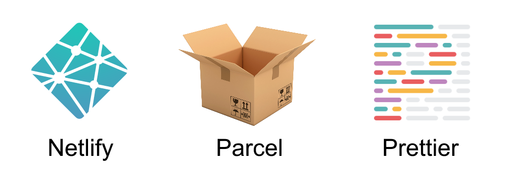

# NPP Template

A quick way to set up a JAM stack site or app. Uses Netlify, Parcel, and
Prettier.



⚠️ Warning: Netlify Dev doesn't currently support Parcel. There is an [open pull
request](https://github.com/netlify/netlify-dev-plugin/pull/234) to support it.
But until the pull request is merged, this template won't work. There is,
however, a [workaround](netlify-parcel-workaround.md). ⚠️

## Getting Started

You can get started by using GitHub. Click the green **Use this template**
button above.

Give your repository a name and click **Create repository from template**.

Clone your new repository to your local development environment.

```
git clone https://github.com/[your username]/[your repo name].git
```

Change into the project directory.

```
cd [your repo name]
```

Install the dependencies.

```
npm install
```

## Develop

Start the development server.

```
netlify dev
```

The site and functions will be built and served at http://localhost:8888

Develop by editing files in the `src/` and `functions/` directories. Changes are
automatically re-built and hot-reloaded.

### Taking advantage of Netlify

Since this template uses [Netlify Dev](https://www.netlify.com/products/dev/),
you have the full power of Netlify's platform right in your development
environment. This includes features like [serverless lambda
functions](https://www.netlify.com/docs/functions/), [redirect & rewrite
rules](https://www.netlify.com/docs/redirects/), and much more.

You can also deploy on Netlify in a few short steps. See the **Deploy** section
below.

### Taking advantage of Parcel

You can manage site assets with Parcel. Simply import them in
`src/scripts/index.js`. For example, you can import [JavaScript
modules](https://parceljs.org/javascript.html) or
[SCSS](https://parceljs.org/scss.html) or [any other asset supported by
Parcel](https://parceljs.org/assets.html).


```javascript
// After running npm install lodash
import _ from "lodash";

const randomNumber = _.random(1, 10);

console.log(randomNumber);
```

### Taking advantage of Prettier

At any time, you can lint your JavaScript files against Prettier's recommended
rules.

```
npm run lint
```

Many problems can be fixed automatically.

```
npm run lint:fix
```

You can also set up your editor to automatically highlight warnings and errors.
If you're using [Visual Studio Code](https://code.visualstudio.com/), all you
need is the
[ESLint](https://marketplace.visualstudio.com/items?itemName=dbaeumer.vscode-eslint)
extension.

1. Press **Ctrl** + **Shift** + **X** or click the **Extensions** button
2. Search for **ESLint**
3. Click the **Install** button next to the **ESLint** search result

Finally, you can choose to have your code automatically fixed and formatted on
save if you wish. Press Add the following to your Visual Studio Code settings.

```
"eslint.autoFixOnSave": true
```

Note that this setting only takes effect if `files.autoSave` is set to `off`,
`onFocusChange`, or `onWindowChange`.


## Deploy

Stage, commit, and push changes to GitHub.

```
git add [changed file]
git commit -m "[Short description of changes]"
git push
```

Connect your repository to Netlify by going to https://app.netlify.com and
clicking the **New site from Git** button. Follow instructions on screen.

The site is automatically pulled over from GitHub, built, and deployed. The site
will continue to automatically deploy every time you push to GitHub.

## License

MIT License

Copyright (c) 2019 Travis Horn

Permission is hereby granted, free of charge, to any person obtaining a copy
of this software and associated documentation files (the "Software"), to deal
in the Software without restriction, including without limitation the rights
to use, copy, modify, merge, publish, distribute, sublicense, and/or sell
copies of the Software, and to permit persons to whom the Software is
furnished to do so, subject to the following conditions:

The above copyright notice and this permission notice shall be included in all
copies or substantial portions of the Software.

THE SOFTWARE IS PROVIDED "AS IS", WITHOUT WARRANTY OF ANY KIND, EXPRESS OR
IMPLIED, INCLUDING BUT NOT LIMITED TO THE WARRANTIES OF MERCHANTABILITY,
FITNESS FOR A PARTICULAR PURPOSE AND NONINFRINGEMENT. IN NO EVENT SHALL THE
AUTHORS OR COPYRIGHT HOLDERS BE LIABLE FOR ANY CLAIM, DAMAGES OR OTHER
LIABILITY, WHETHER IN AN ACTION OF CONTRACT, TORT OR OTHERWISE, ARISING FROM,
OUT OF OR IN CONNECTION WITH THE SOFTWARE OR THE USE OR OTHER DEALINGS IN THE
SOFTWARE.
